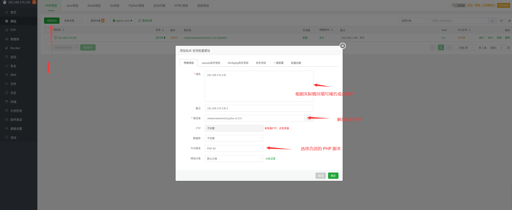
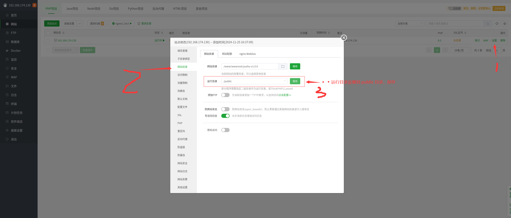
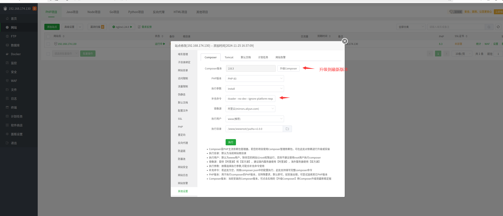
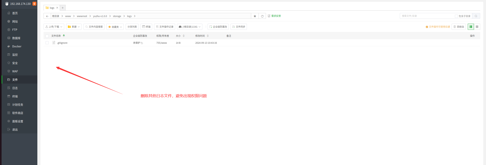

# 部署

## 下载代码

[https://gitee.com/hefengbao/yuzhu/releases](https://gitee.com/hefengbao/yuzhu/releases) 或者 [https://github.com/hefengbao/yuzhu/releases](https://github.com/hefengbao/yuzhu/releases) 下载代码（压缩包）。

## 上传代码


解压代码：


## 添加数据库


## 添加站点




一些设置：

设置运行目录：




复制粘贴如下内容，注意 `php8.3-fpm.sock` 这里根据实际的 PHP 版本修改，如果是 8.2 版本，则是 `php8.2-fpm.sock`, 以此类推。

```
location / {
        try_files $uri $uri/ /index.php?$query_string;
    }

location ~ \.php$ {
    fastcgi_pass unix:/var/run/php/php8.3-fpm.sock;
    fastcgi_param SCRIPT_FILENAME $realpath_root$fastcgi_script_name;
    include fastcgi_params;
    fastcgi_hide_header X-Powered-By;
}
```

安装依赖：



点击【升级Composer】,提示升级成功后，点击左侧的【其他设置】，composer 会应用最新的版本。

复制 `--optimize-autoloader --no-dev --ignore-platform-reqs` 粘贴到【补充命令】那里。

配置好后点击【执行】。


一点修改：

复制 `.env.example` 文件，修改名称为 `.env`，编辑 `.env` 文件：


修改权限：


需要修改的内容：

```
APP_NAME=玉竹 #修改为自己的博客名称，若中间有空格、标点符号，请用英文引号（""）包裹
APP_ENV=production


APP_URL=http://127.0.0.1 # 修改为自己的域名或公网IP
ASSET_URL=http://127.0.0.1 # 修改为自己的域名或公网IP


MAIL_MAILER=smtp
MAIL_HOST=mailhog 
MAIL_PORT=1025
MAIL_USERNAME=null
MAIL_PASSWORD=null
MAIL_ENCRYPTION=null
MAIL_FROM_ADDRESS="hello@example.com"

SESSION_DRIVER=redis

QUEUE_CONNECTION=redis

CACHE_STORE=redis

```

邮箱配置参考 [使用 QQ 邮箱作为邮箱服务](deploy#使用-qq-邮箱作为邮箱服务)。

登入终端，运行命令：


```shell
cd /www/wwwroot/yuzhu-v1.0.0 # 修改为实际的目录
```

```shell
php artisan key:generate
```

遇到权限问题，可使用 `sudo php artisan key:generate` 命令。

创建软软连接：

```shell
php artisan storage:link
```


初始化数据库：

```shell
php artisan migrate
```


初始化站点：

```shell
php artisan yuzhu:init
```


删除安装过程中因报错等生成的 Log 文件，以避免出现权限问题。




访问：


管理后台在域名后添加 `/admin` 访问即可。


以下操作在终端完成：

安装 `supervisor`:

```shell
sudo apt install supervisor
```

```shell
sudo vi /etc/supervisor/conf.d/yuzhu-horizon.conf
```

复制如下内容，注意修改为自己的目录，

```
[program:yuzhu-horizon]
process_name=%(program_name)s
command=php /www/wwwroot/yuzhu-v1.0.0/artisan horizon
autostart=true
autorestart=true
user=www
redirect_stderr=true
stdout_logfile=/www/wwwroot/yuzhu-v1.0.0/storage/logs/horizon.log
stopwaitsecs=3600
```

鼠标右键粘贴，然后输入 `:wq` 保存。


```shell
sudo supervisorctl reread

sudo supervisorctl update

sudo supervisorctl start yuzhu-horizon:*
```

一些优化：

```shell
php artisan optimize
php artisan filament:optimize
```


设置定时任务：


```
cd /www/wwwroot/yuzhu-v1.0.0 && php artisan schedule:run
```

注意设为自己实际的目录

