# 搭建环境

玉竹（Yuzhu）使用 PHP 语言开发。

## `PHP` 版本选择 8.2 及以上版本：

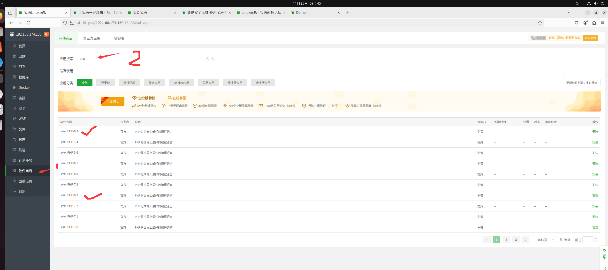

设置：

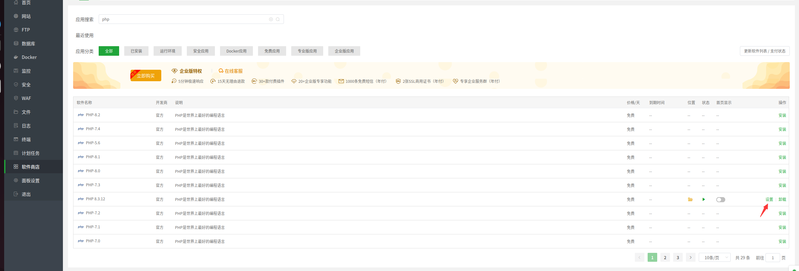

安装扩展：

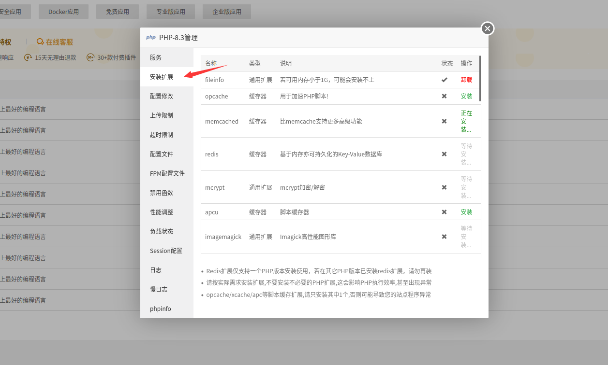

需要安装的扩展参考 [https://laravel.com/docs/11.x/deployment#server-requirements](https://laravel.com/docs/11.x/deployment#server-requirements)

删除被禁用的函数：`proc_open `，`symlink`,`pcntl_*` 相关的函数

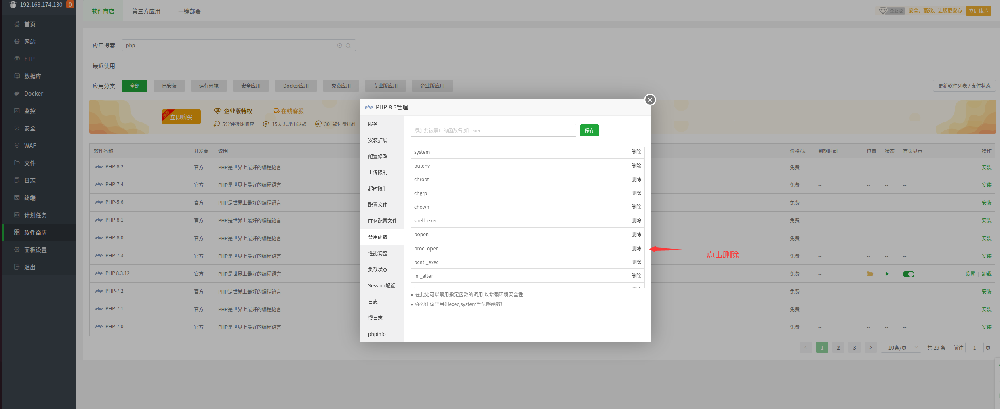

## 服务器软件选择 `Nginx`:

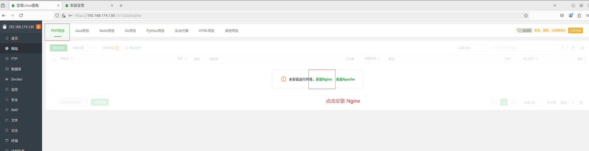

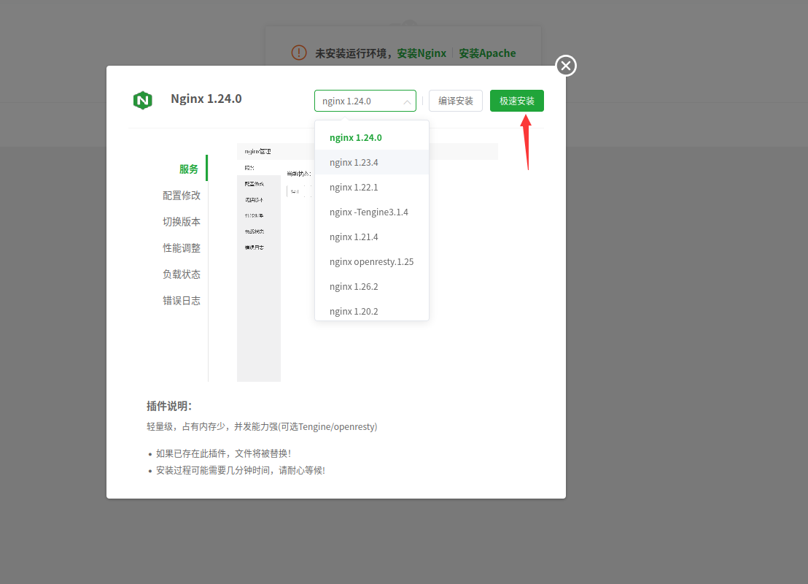

## 数据库选择 `MySql`:

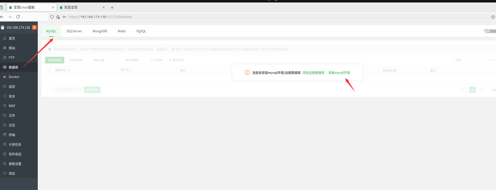

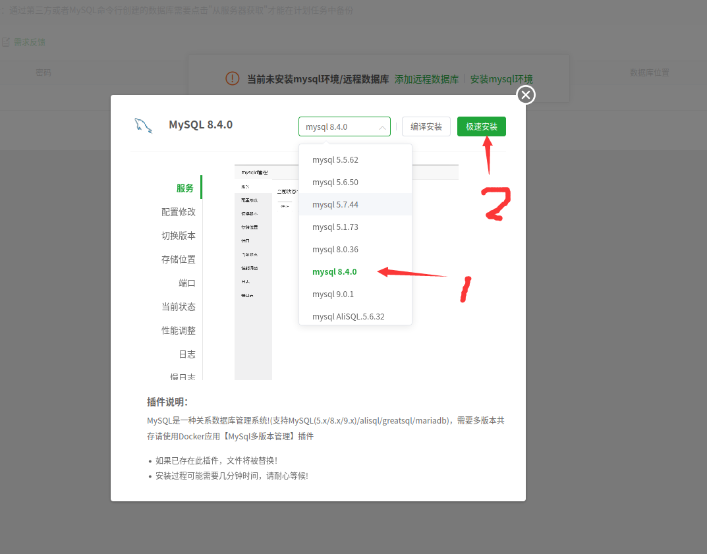

顺便安装 phpMyAdmin,选择最高的版本即可：

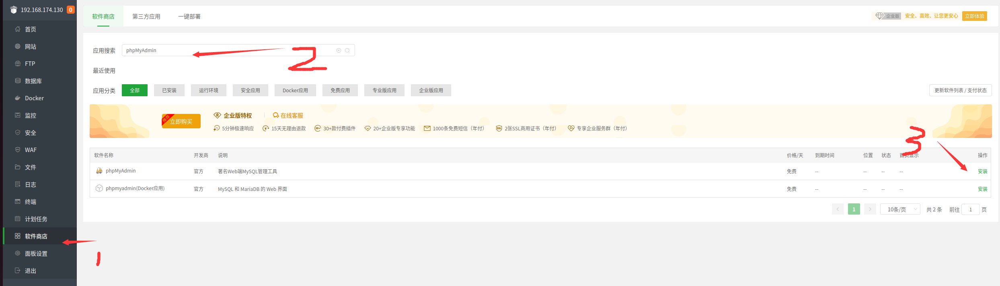

## 缓存使用 `Redis` 数据库：

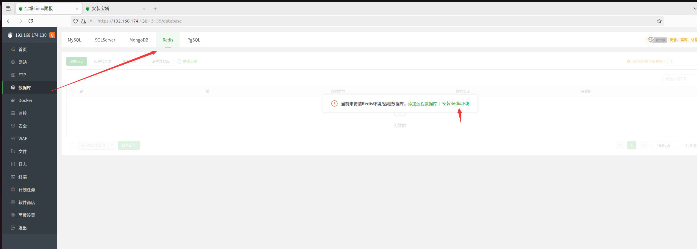

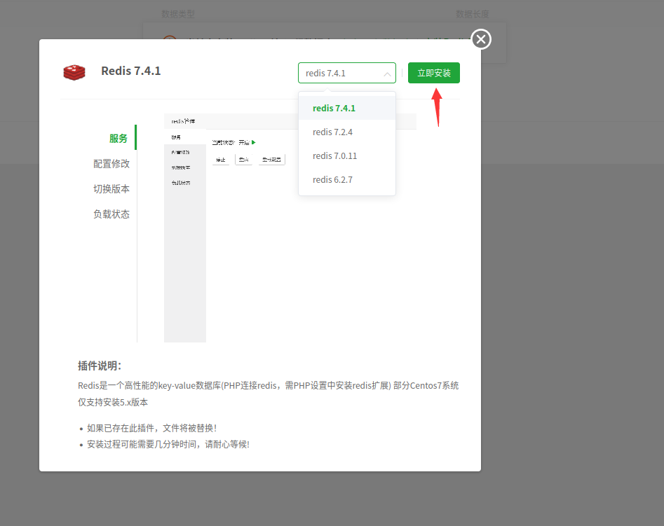

