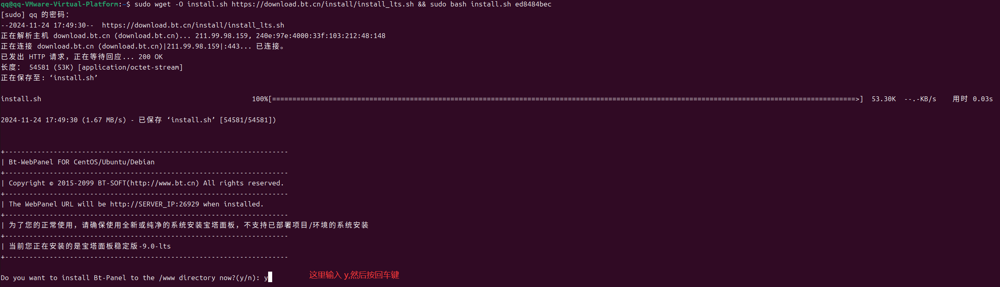
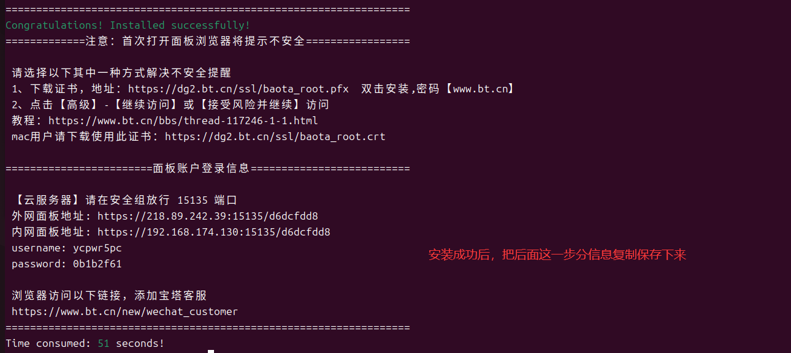
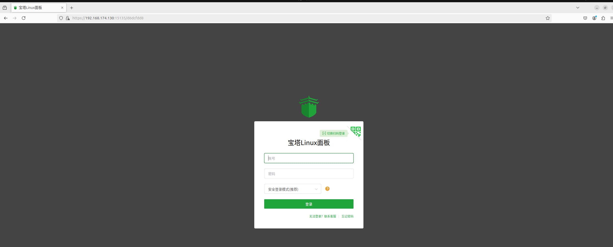

# 宝塔安装

参考 [https://www.bt.cn/new/download.html](https://www.bt.cn/new/download.html) 安装，应该没难度。

比如我使用的是 Ubuntu,远程连接后，打开 Terminal， 直接运行如下命令即可：

```shell
sudo wget -O install.sh https://download.bt.cn/install/install_lts.sh && sudo bash install.sh ed8484bec
```










有关端口之类的设置可参考：

[新手建站指南—宝塔面板的安装与使用教程(详细)](https://blog.csdn.net/m0_47510309/article/details/108910383)