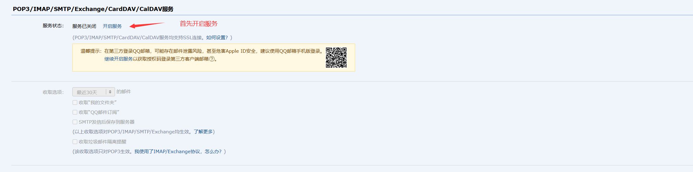
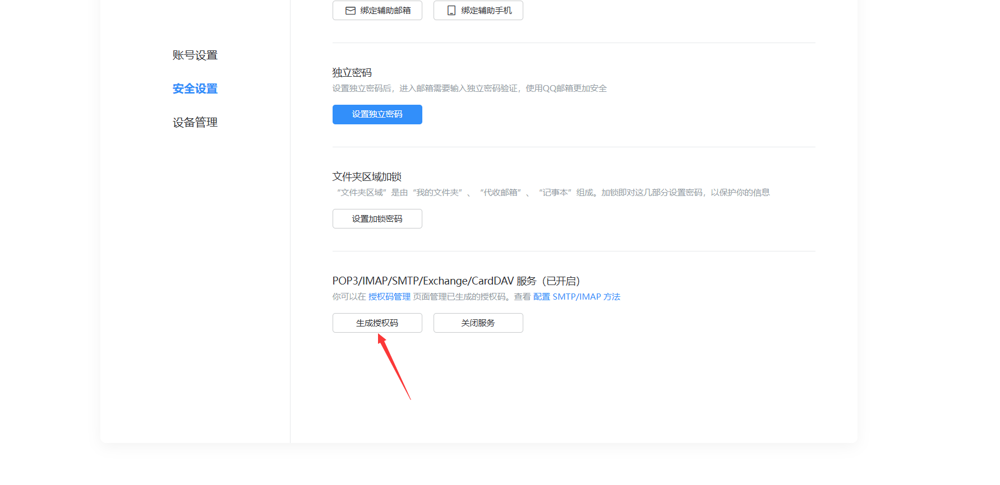

# 部署

## 创建数据库

```bash
mysql -u root -p

create database if not exists yuzhu default character set utf8mb4 default collate utf8mb4_general_ci;

create user 'yuzhu'@'localhost' identified with caching_sha2_password by '密码';  # 密码自行定义

grant all privileges on <yuzhu>.* to 'yuzhu'@'localhost';

flush privileges;

exit;
```

## 下载源码

### 1. 直接下载

[https://github.com/hefengbao/yuzhu/releases](https://github.com/hefengbao/yuzhu/releases)

### 2. 克隆代码

```
git clone https://github.com/hefengbao/yuzhu.git /var/www/yuzhu
````

```shell
cd /var/www/yuzhu

git checkout release
```

## 安装扩展包：

```bash
composer install --optimize-autoloader --no-dev --ignore-platform-reqs
```

## 配置：

```
cp .env.example .env
php artisan key:generate
```

在 `.env` 文件中修改配置，主要是下面几项：

```
APP_NAME=玉竹 #修改为自己的博客名称，若中间有空格、标点符号，请用英文引号（""）包裹
APP_ENV=production
APP_KEY=
APP_DEBUG=false
APP_URL=http://localhost # 修改为自己博客域名

...

DB_DATABASE=yuzhu // 修改数据库名称
DB_USERNAME=yuzhu    //修改数据库账号
DB_PASSWORD=        //修改数据库密码

...

MAIL_MAILER=smtp
MAIL_HOST=mailhog 
MAIL_PORT=1025
MAIL_USERNAME=null
MAIL_PASSWORD=null
MAIL_ENCRYPTION=null
MAIL_FROM_ADDRESS="hello@example.com"


SESSION_DRIVER=redis

QUEUE_CONNECTION=redis

CACHE_STORE=redis

```

### 使用 QQ 邮箱作为邮箱服务

如果没有其他邮箱服务，可以使用 QQ 邮箱，登录 QQ 邮箱，选择 【设置】 - 【账号】，【POP3/IMAP/SMTP/Exchange/CardDAV/CalDAV服务】 ：




如果已开启，在点击 【管理服务】 - 【生成授权码】：




示例配置：

```
MAIL_MAILER=smtp
MAIL_HOST=smtp.qq.com 
MAIL_PORT=465
MAIL_USERNAME="10000@qq.com"
MAIL_PASSWORD=授权码
MAIL_ENCRYPTION=ssl
MAIL_FROM_ADDRESS="10000@qq.com"
```


验证邮箱是否配置成功：

```shell
php artisan yuzhu:check-email

php artisan queue:work --queue=high,default
```

## 生成数据表及数据填充:
```
php artisan migrate --seed
```

## 用户组

```shell
chown -R $USER:www-data ./
```

## 读写权限

```
chmod -R 775 storage/ bootstrap/
```

## 初始化管理员

```shell
php artisan yuzhu:init-admin
```

## Nginx 站点配置

可参考：

```bash
server {
    listen 80;
    listen 443 ssl http2;
    server_name yuzhu.test;
    root "/var/www/yuzhu/public";
    
    add_header X-Frame-Options "SAMEORIGIN";
    add_header X-Content-Type-Options "nosniff";
    
    index index.php;

    charset utf-8;

    location / {
        try_files $uri $uri/ /index.php?$query_string;

    }

    location = /favicon.ico { access_log off; log_not_found off; }
    location = /robots.txt  { access_log off; log_not_found off; }

    error_page 404 /index.php;

    access_log off;
    error_log  /var/log/nginx/yuzhu-error.log error;

    sendfile off;
    
    location ~ \.php$ {
        fastcgi_split_path_info ^(.+\.php)(/.+)$;
        fastcgi_pass unix:/var/run/php/php8.3-fpm.sock;
        fastcgi_index index.php;
        include fastcgi_params;
        fastcgi_param SCRIPT_FILENAME $document_root$fastcgi_script_name;


        fastcgi_intercept_errors off;
        fastcgi_buffer_size 16k;
        fastcgi_buffers 4 16k;
        fastcgi_connect_timeout 300;
        fastcgi_send_timeout 300;
        fastcgi_read_timeout 300;
    }

    location ~ /\.ht {
        deny all;
    }

    ssl_certificate     /etc/ssl/certs/yuzhu.test.crt;
    ssl_certificate_key /etc/ssl/certs/yuzhu.test.key;
}
```

## 配置并运行 Horizon

在 `/etc/supervisor/conf.d` 目录中添加 `yuzhu-horizon.conf` 文件，内容如下：

```shell
[program:yuzhu-horizon]
process_name=%(program_name)s
command=php /var/www/yuzhu/artisan horizon
autostart=true
autorestart=true
user=web
redirect_stderr=true
stdout_logfile=/var/www/yuzhu/storage/logs/horizon.log
stopwaitsecs=3600
```

```shell
sudo supervisorctl reread

sudo supervisorctl update

sudo supervisorctl start yuzhu-horizon:*
```

### 添加 Cron 配置项（定时任务）

```shell
crontab -u www-data -e
```

```shell
* * * * * cd /var/www/yuzhu && php artisan schedule:run >> /dev/null 2>&1
```

## 优化

```shell
php artisan route:cache
php artisan view:cache
php artisan config:cache
```